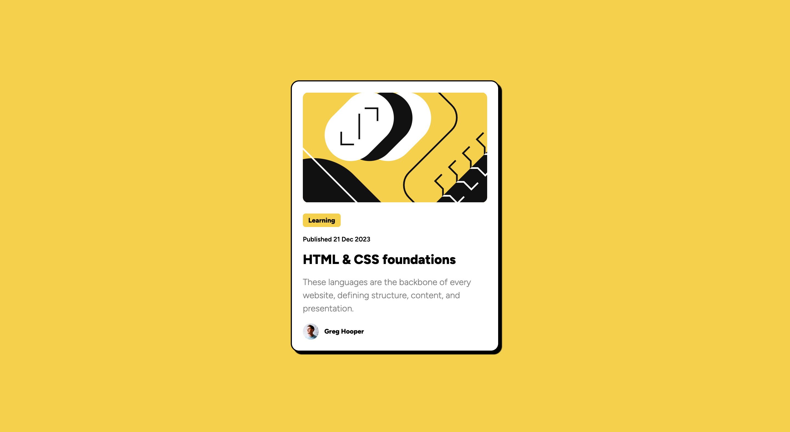

# Frontend Mentor - Blog preview card solution

This is my solution to the [Blog preview card challenge on Frontend Mentor](https://www.frontendmentor.io/challenges/blog-preview-card-ckPaj01IcS).

## Table of contents

- [Overview](#overview)
  - [Screenshot](#screenshot)
  - [Links](#links)
- [My process](#my-process)
  - [Built with](#built-with)
  - [What I learned](#what-i-learned)
  - [Continued development](#continued-development)
  - [Useful resources](#useful-resources)
- [Author](#author)
- [Acknowledgments](#acknowledgments)

## Overview

### Screenshot

### Links

- Solution URL: [Github](https://github.com/Mirthaar/blog-preview-card)
- Live Site URL: [Github Pages](https://mirthaar.github.io/blog-preview-card/)

## My process

### Built with

- Semantic HTML5 markup
- CSS custom properties
- Flexbox

### What I learned

I found Frontend Mentor while searching for additional resources and challenges as I work through The Odin Project (TOP). The Odin Project has been an amazing resource for learning Web Deb, but I find that practicing as much as possible will be a key component to my success. Queue Frontend Mentor! I look forward to completing more exercises in sequential order from easiest to hardest.

Having moved onto the javascript exercises via TOP, I found that I was quickly losing some of the basics when it comes to HTML/CSS. This project was a nice refresher and return to the material I learned from the website project in TOP. This exercise reinforced the following for me:

- Linking fonts from Google Fonts both in the HTML and CSS file
- Establishing a solid file structure and linking to the .css
- Flexbox concepts and assigning classes when appropriate

### Continued development

While I have a good grasp on Flexbox, I still feel I have more to learn. I'm often guessing at what the flex property might do or I still scratch my head with the flex property itself - including flex-basis. I look forward to practicing more CSS exercises to further reinforce my current knowledge.

### Useful resources

- [HTML Cheatsheet](https://htmlcheatsheet.com/) - A great resource to quickly look up HTML properties, structures, tags, etc.
- [FLEX: A visual cheatsheet](https://flexbox.malven.co/) - This is an amazing resource to quickly reference all the different properties of the flexbox system.

## Author

- Website - [Mirthaar](https://mirthaar.github.io/website/)
- Frontend Mentor - [@Mirthaar](https://www.frontendmentor.io/profile/yourusername)
- Github - [@Mirthaar](https://github.com/Mirthaar)

## Acknowledgments

My acknowledgements go to [The Odin Project] (https://www.theodinproject.com/) for getting me this far along!
